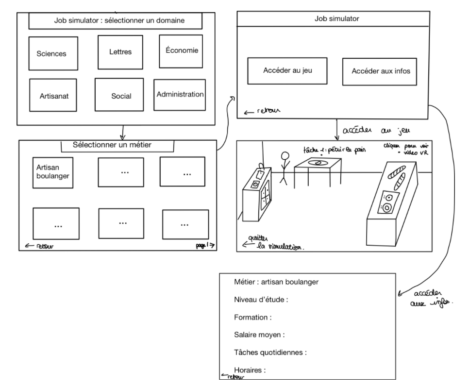

=== Interface utilisateur graphique

//Il peut y avoir une ou plusieurs interfaces utilisateur (UI en anglais),
//ou interface graphique, ou interface homme machine (IHM) : une interface
//sur ordinateur et/ou une interface sur mobile ou tablette (Android),
//selon le nombre d’appareils en jeu.

//En lien avec un diagramme de séquence, une description simple de chaque
//écran/page est nécessaire. Il est recommandé de faire des dessins, même
//dessins au crayon, photographiés ou scannés, car ce sont les meilleurs
//supports de discussion : on appelle souvent ces dessins un
//« storyboard ». Une description textuelle fait le lien entre tous les
//éléments de l’IHM (ou des IHMs).

Description du storyboard : 

L’utilisateur lance le jeu et doit sélectionner un domaine particulier. En cliquant sur une des cases, il accède à une deuxième interface de sélection plus précise, il doit alors choisir le métier qui l’intéresse. Il peut également retourner sur la page précédente et choisir un autre domaine en cliquant sur le bouton retour. Une fois le métier choisi, l’utilisateur a la possibilité de sélectionner « accéder au jeu » ou « accéder aux infos ». 
S'il clique sur accéder au jeu, il rentre alors dans l’univers correspondant au métier sélectionné, et peut réaliser différentes tâches (par exemple pétrir le pain pour le boulanger) en cliquant à l’endroit adéquat. Il peut également cliquer sur une partie de l’écran indiquée pour accéder à une vidéo 360 dans laquelle un professionnel fournit des explications. Il peut quitter le jeu en cliquant sur « quitter la simulation ».
S'il choisit « accéder aux infos », il accède à une page regroupant des informations sur le métier sélectionné, comme le volume horaire, la formation etc. 

