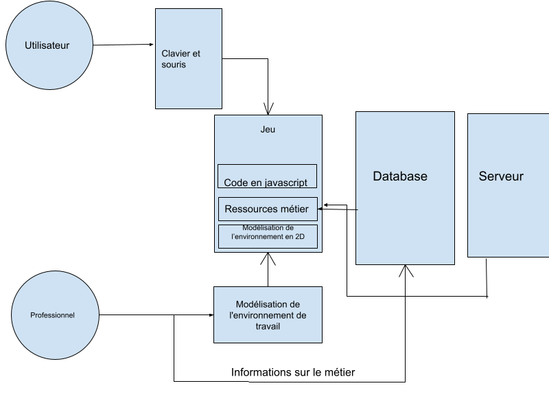
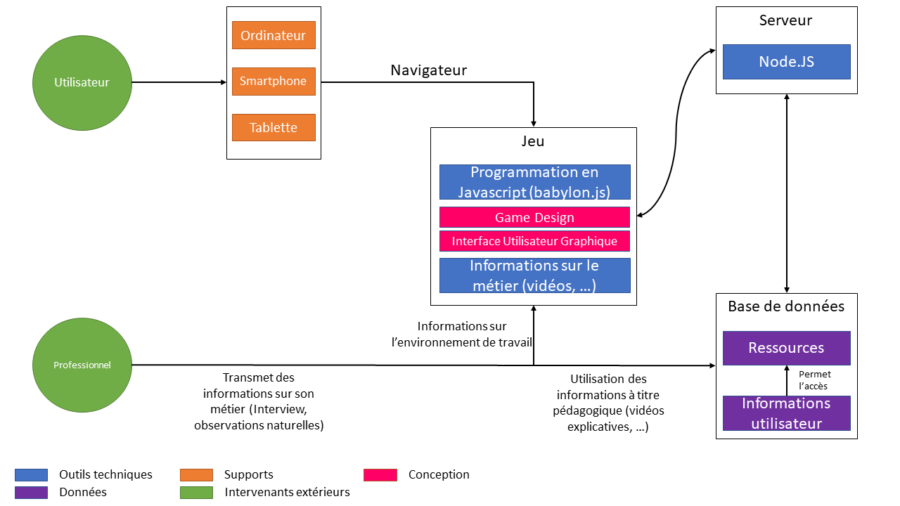
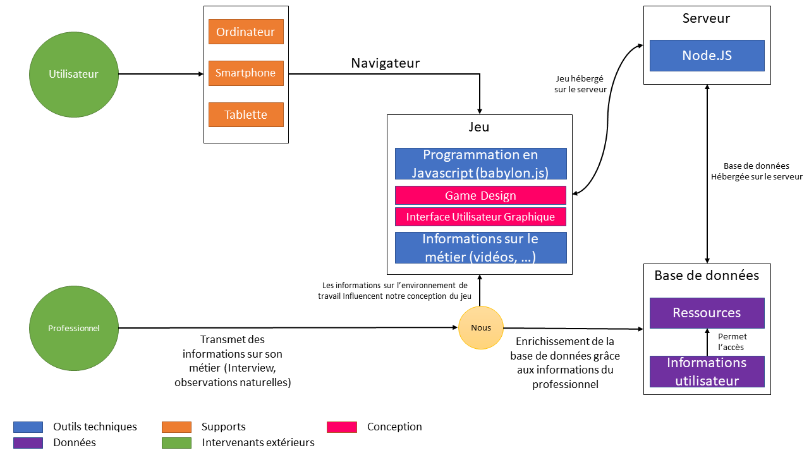

=== Schéma d’architecture

==== Première version du schéma d'architecture

==== Schéma d'architecture final

//Insérer ici un ou plusieurs schémas d’architecture du projet. Voir le
//cours d’introduction au Génie Logiciel. N’hésitez pas à faire des
//schémas hiérarchiques, c'est-à-dire avec un bloc d’un schéma général
//raffiné dans un second schéma ; ou des schémas en plusieurs parties.

==== Schéma d'architecture modifié après le PAN1

==== Description des blocs

//Il faut ici une description textuelle de chaque bloc, sa fonction
//détaillée. En général, un bloc correspond à un module, sauf exception.
//Il peut être adapté de faire des blocs plus petits qu’un module.

//Il est important ici de distinguer les bibliothèques identifiées et
//disponibles de ce que vous allez produire (coder) vous-même. Vous ne
//devez pas réinventer la roue, mais vous ne devez pas non plus avoir votre
//projet tout fait en encapsulant un programme déjà existant.

===== Utilisateur

Correspond à l'utilisateur qui joue au jeu.

===== Professionnel

Le professionnel est celui qui apporte des informations sur son métier.

===== Ordinateur, tablette, smartphone

Supports par lesquels l'utilisateur va interagir pour jouer au jeu.

===== Jeu
La conception et l'implémentation du jeu se découpent en 4 grandes parties (modules).

====== Game Design
Ce module gère le fonctionnement du jeu : les principes, le but, les règles, … ; entre autres, la manière de jouer.

====== L'interface utilisateur graphique
Quelles sont les informations qui apparaissent constamment à l’écran du joueur ou lorsqu’il réalise une action. Cela correspond à l'interaction "graphique" entre l'utilisateur et le jeu.

====== Programmation du jeu
Après avoir conçu l’idée générale du jeu, il faut l’implémenter. Pour ce faire, nous allons utiliser le moteur de jeu Javascript babylon.js, le jeu sera ainsi jouable sur n’importe quel support (Ordinateur, tablette, smartphone).

====== VR / Vidéo 360
Ce module gère l’intégration des vidéos (360 ou non) réalisées lors du module *Observations naturelles* dans le jeu. Ces vidéos seront visionnées par le joueur lors de ses différentes tâches et constituent ainsi des sources d’informations.

===== Serveur
Le serveur en nodejs répondra aux requêtes des clients pour mettre en relation les joueurs, leur fournir les ressources média et les informations stockées dans la base de données.

===== Base de données
Bloc Base de données (module) : La base de données contiendra différentes ressources pédagogiques sur les métiers et les données de l’utilisateur. En fonction du niveau scolaire de l’utilisateur (collégien, lycéen, …), il aura accès à des ressources plus ou moins complexifiées. On compte implémenter la base de données avec Mongodb.
