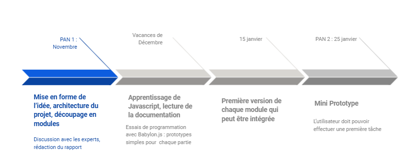

=== Planning temporel PACT

==== Taches / PAN1 18/11/21

===== Générales

* rapport:

[cols=",^,^,,",options="header",]
|====
|Tâche |Qui |Quand |Fait |Remarques
|Sujet |Diane et Kenza |9 novembre |✓ |
|Sujet en anglais |Diane |9 novembre |✓ |
|Description de la proposition |Kenza |9 novembre |✓ |
|Scenario | Thibault |Octobre |✓ |
|Architecture (schéma et description des blocs) |Thibault |9 novembre |✓ |Précisions apportées par Paul-Marie sur le bloc serveur
|Description des interfaces |Paul-Marie |10 Novembre |✓ |
|Interface utilisateur graphique (storyboard)|Diane |9 novembre |✓ |
|Découpage en modules |Concertation générale |Fin Octobre | ✓|
|Etat de l'art |Hugo et Bacem |9 novembre |✓ | A été rédigé dans un premier temps sur un google doc avant d'être "push" par Hugo
|Planning temporel (ce document, personnalisé) |L'ensemble du groupe |10 novembre |✓ |
|====

* présentation 15mn

[cols=",^,^,,",options="header",]
|====
|Tâche |Qui |Quand |Fait |Remarques
|préparation du document | L'ensemble du groupe | |✓ | Chaque personne rédige la partie qu'elle a développée dans le rapport ainsi que ses propres modules
|répartition de la parole |Ensemble du groupe | | ✓|
|répétition |L'ensemble du groupe|Mercredi soir (17/11)  | |
|====

==== Taches / PAN2 25/01/22

===== Générales

* rapport

[cols=",^,^,,",options="header",]
|====
|Tâche |Qui |Quand |Fait |Remarques
|Redécoupage et regroupements de modules |Groupe entier |24 novembre  |✓ |Suite aux remarques de Tarik Graba et Jean-Claude Dufourd
|mise à jour de l’architecture | Thibault |6 décembre | ✓| Une première modification après les remarques du PAN 1
|interfaces | | | |
|Plan de test par module et global |Thibault, Hugo, Diane, Kenza, Paul-Marie |6 décembre | Une première ébauche | Chacun s'est occupé de son module, les responsables du module test et intégration se sont concertés avec les autres modules
|avancement | | | |
|==== 

* Timeline prévisionnelle 

[cols=",^,^,,",options="header",]
|====
|Tâche |Qui |Quand |Fait |Remarques
|Apprentissage de Javascript, lecture respective de la documentation utile pour sa partie|Groupe entier |Vacances décembre  | | Pendant l'apprentissage, nous pourrons nous entraîner à faire des prototypes de nos parties respectives
|Chaque personne doit avoir produit une première version de sa partie qui peut être intégrée| | 15 janvier | | Ex : Un environnement 3D de la boulangerie, un personnage qui se déplace, "input" d'un controller, animation 3D/2D, un début de serveur, un début de base de données
|Mini Prototype | |25 janvier | | L'utilisateur doit pouvoir effectuer une première tâche (pétrir)

|====

* Prendre rdv avec vos experts pour le PAN2

[cols=",^,^,,",options="header",]
|====
|Tâche |Qui |Quand |Fait |Remarques
|| | | |
|||||
|====

===== Modules

* Synthèse 3D WebGL (Jean Le Feuvre)

[cols=",^,^,",options="header",]
|====
|Tâche |Quand |Fait |Remarques
|Réunion avec Jean Le Feuvre |1er décembre |✓| Concertation avec Jean Le Feuvre, utilisation de babylonjs qui permet de simplifier la synthèse 3D
|Apprentissage JavaScript | Jusqu'aux vacances de décembre |✓ |Javascript et documentation de babylonjs
|Programmation du changement de scène | 12/01|✓|
|Pogrammation "input"|Mi-janvier|✓|Surtout pour les déplacements
|Programmation interface graphique | | |
|Programmation animations | | |
|Programmation déplacements |Mi-janvier|✓|
|Le tutoriel javascript moderne||✓|https://fr.javascript.info/
|Documentation Bbaylonjs||✓|https://doc.babylonjs.com/
|Quelques modèles 3D||✓|https://3dwarehouse.sketchup.com/search/?q=boulangerie&searchTab=collection
|====

* Test & Intégration (Jean-Claude Dufourd)

[cols=",^,^,",options="header",]
|====
|Tâche |Quand |Fait |Remarques
|Etablissement du plan de test |6/12/21|✓|
|Modification du diagramme d'architecture|6/12/21|✓|
|Création d'un Trello |Debut janvier|✓|
|====

* Interface Web (Jean-Claude Dufourd)

[cols=",^,^,",options="header",]
|====
|Tâche |Quand |Fait |Remarques
|Installation de nodejs et des environnements nécessaires |Fin Novembre |✓ |
|Apprentissage de JS et node pour démarrer le projet ensuite |Décembre-Janvier|✓| L'ensemble des tutoriels présents sur le web sont très denses et il est dur de trouver des MOOCs par exemple qui permettent d'appréhender le langage plus facilement, appui sur Paul-Marie pour nous guider dans notre apprentissage
|Prise de rendez-vous pour le PAN2 |14 janvier |✓ |
|Début de développement d'une ébauche d'interface |Fin Janvier - Début Février |✓ | L'interface témoigne uniquement pour le moment d'un menu de connection avec sauvegarde des données utilisateur sur MongoDB et l'accès à une première page initiale du jeu. Cette interface permet surtout un peu d'application de ce qui a été vu dans l'apprentissage
|Apprentissage des webSockets |16 Février|✓ |Volonté de Paul-Marie que nous les maitrisions pour le développement du mode multijoueur du jeu.
|Rendez-vous PAN2 |24 février|✓ | Démonstration de nos avancées avec les premiers codes écrits. Permet à M. Dufourd de contrôler notre bonne maitrise des différents modules de JS nécessaires à la construction effective du site en soutien du jeu. Présentation du premier système d'authentification, des débuts d'avancées de Bacem sur la gestion du multijoueur. Planification de la suite : setup du site en accord avec la philosophie du jeu, utilisation de CSS pour la stylistique des pages HTML, création d'un questionnaire pour avoir une deuxième option de sélection de métiers, options de modification de paramètres utilisateurs et mot de passe oublié.
|====

* Game Design (Aliénor Morvan)

[cols=",^,^,",options="header",]
|====
|Tâche |Quand |Fait |Remarques
|Réunion de d'introduction au module avec l'expert  | 02/12 |✓  |Nécessité de s'organiser pour une prise de rendez-vous/entretiens à propos du métier. Création d'une carte heuristique à partir des informations recueillies.
|Demande de regroupement avec Observations naturelles et Thibault | 06/12|✓ | Demande acceptée par Mme Morvan le 07 puis acceptée par M. Dufourd le 10
|Interview d'un CAP boulanger par Thibault |11/12 |✓ | Interview uniquement à l'écrit pour le moment, obtention d'enregistrements audio durant les vacances.
|Elaboration d'une première carte heuristique Numérique & Physique |15/12 |✓ | Carte pour le moment incomplète car un seul entretien
|Réunion avec l'experte|15/12 |✓| Première réunion avec Thibault qui a été ajouté au module depuis la réunion précédente avec l'absorption du module observations naturelles (proximité de Thibault avec le monde de la boulangerie). L'experte nous demande de réaliser des interviews, entretiens avec des professionnels de plusieurs professions distinctes. Même si le jeu produit à la fin ne présentera à priori qu'un seul métier, pour répondre au problème initial il faut montrer qu'on a pensé à plus de métiers distincts car la le monde profesionnel n'est pas formé d'une seule catégorie de professions.
|Réunion avec l'experte|12/01|✓| Récit de nos différentes interviews réalisées durant les vacances sur 3 métiers qui n'ont pas énormément à voir. L'experte nous indique de travailler les données recueillies sur ces interviews pour comparer ces métiers et voir ce qui les distingue sur certains aspects. Ces apects doivent apparaitre dans notre jeu pour diriger les utilisateurs qui ne savent pas trop vers ou se tourner. Métiers sélectionnés : Boulanger, Cheminot, Journaliste freelance
|Réunion avec l'experte |26/01|✓| Bilan du classement de ces aspects. L'experte nous demande de produire un synopsis du jeu pour chaque métier. Développement plus approfondi du scénario pour le boulanger avec production de storyboards en vue de l'entretien pour le PAN 2.
|Entretien PAN2 |17/02|✓| Présentation de nos proofs of concept sur les trois métiers retenus au préalable : cheminot, journaliste et boulanger. Présentation plus approfondie du métier de boulanger avec des premiers screenshots des scènes en cours de production pour le jeu. Introduction à nos choix de police et de gamme de couleurs pour rendre le jeu plus inclusif (adapté à un utilisateur dyslexique et/ou daltonien). Veto sur la police Comic Sans MS. 
|====

* Vidéo 360 (Jean Le Feuvre)

[cols=",^,^,",options="header",]
|====
|Tâche |Quand |Fait |Remarques
|Apprentissage JavaScript ||✓ |Javascript et documentation de babylonjs
|Le tutoriel javascript moderne||✓|https://fr.javascript.info/
|Documentation Bbaylonjs||✓|https://doc.babylonjs.com/
|Affichage d’un rectangle de couleur unie + animation de position, vérification de la compatibilité sur desktop et Android (iOS aussi si besoin)||✓|
|Affichage d’un rectangle texturé avec une vidéo en plein écran||✓|
|Edition de fragment shader pour changer l’affichage vidéo ou utilisation d’une sphère pour l’affichage video|||
|Affichage d'une image 360|||✓|

|====

==== Tâches / PAN3 19/04/22

===== Générales

* Préparer le concept du jeu afin qu'il soit fonctionnel;
* Préparer un échelonnage des tâches et travaux effectués pour la présentation;
* Travailler sur la chronologie à adopter pour la présentation;
* S'exercer une ou plusieurs fois pour s'asssurer que le projet fonctionne et ne pas hésiter à filmer pour conserver en secours une présentation qui fonctionne.

===== Modules

* Programmation synthèse

[cols=",^,^,",options="header",]
|====
|Tâche |Quand |Fait |Remarques
|Ajout d'une scène prototype | Mars 2022 | Oui |
|Ajout d'une scène pour les vdiéos | Avril 2022 | Oui |
|Ajout d'une scène pour le GUI | Avril 2022 | Oui |
|Création de l'ensemble des GUI | Février-Avril 2022| Oui |
|Implémentation d'une compatibilité mobile | Débuté avril 2022 | |Début d'implémentation de la compatibilité mobile mais pas totalement fonctionnellle
|====

* Game Design

[cols=",^,^,",options="header",]
|====
|Tâche |Quand |Fait |Remarques
|Définition des principes du jeu |Février 2022|✓|
|Colorimétrie du jeu |Février 2022|✓|
|Questionnaire d'orientation |Commencé en février 2022 |✓| Elaboration du quizz en collaboration avec le module Interface Web afin de pouvoir implémenter correctement une réponse adaptée aux souhaits de l'utilisateur.
|Décisions pour rendre le jeu plus accessible |Février 2022|✓|
|Travail de supervision et de conseils|Depuis Mars 2022|| Exercé au près des modules de Programmation Synthèse et Interface Web afin de conserver la direction choisie au cours du PAN2 et empruntée durant le PAN 3 sur le design du jeu. Exploitation de l'ensemble des données recueillies lors du PAN précédent.
|====

* Interface Web

[cols=",^,^,",options="header",]
|====
|Tâche |Quand |Fait |Remarques
|Répartition des tâches au sein du groupe en vue de la piscine |Début mars|✓| Bacem s'occupera en majorité de former les styles de pages sur CSS et le choix de métier direct, Kenza s'occupe du questionnaire pour sélectionner un métier tandis qu'Hugo avance sur les processus de connection, de gestion de profil et la création de deux menus intermédiaires permettant d'accéder aux travaux de Kenza et Bacem.
|Nettoyage, architecture et intégration du code (notamment pages html)|Début de piscine|✓|Nettoyage nécessaire pour l'intégration suivante (nécessité d'avoir que des codes propres à réunir pour que tout fonctionne correctement ensuite). Il s'agit d'une première intégration "intra-module" avant que l'intégration puisse avoir lieu au niveau de tous les modules.
|Implémentation d'une première version du site|Début de piscine|✓|Première version basique du site sans stylistique mais qui permet la toute première intégration. Après installation de mongoose chez les codeurs de Programmation Synthèse afin qu'il puisse directement accéder au jeu à proprement parler en utilisant le système d'authentification.
|Stylistique des pages|Piscine|✓| Bacem aboutit sur 3 designs diffèrents avec un design pour les paramètres utilisateurs/login qui est implémenté ensuite par Hugo en adéquation avec le travail déjà effectué. Sélection d'un design sur les deux possibles pour le menu.
|Questionnaire|Piscine|✓| Kenza implémente un questionnaire pour l'utilisateur qui permet de conseiller un métier en fonction des aspirations du joueur. Le code est ensuite implémenté en réutilisant la stylistique codée par Bacem.
|Paramètres Utilisateurs|Piscine|✓| Implémentation du menu permettant de modifier les paramètres d'un compte utilisateur. Utilisation du design sélectionné.
|Menu choix|Début avril|✓| Implémentation du menu offrant au joueur de choisir un métier, code de Bacem permettant de rechercher soi-même dans une barre de rechercher et permettant de rajouter des menus très facilement.
|Mot de passe oublié|Début avril|✓| Hugo implémente le système permettant de retrovuer son mot de passe avec un envoi par mail avec l'adresse du jeu du mot de passe correspondant.
|PAN 3| 19 avril|✓| Démonstratio ndu travail effectué jusqu'à présent : création de compte, oubli de mot de passe, modification de compte, navigation dans les menus, test du questionnaire et des résultats attribués et accès au jeu.
|====

* Test et intégration

[cols=",^,^,",options="header",]
|====
|Tâche |Quand |Fait |Remarques
|Intégration des modules | Avril 2022|Oui | Paul-Marie s'est chargé de l'intégration de l'ensemble de l'application, Thibault s'est chargé de l'intégration du module vidéo/VR et game design avec la programmation synthèse
|Intégration sur le serveur |Depuis janvier 2022 |Oui |
|====

* Vidéo 360

[cols=",^,^,",options="header",]
|====
|Tâche |Quand |Fait |Remarques
|Enregistrements de vidéos 360 | Avril | X | Synchronisation entre l'emprunt de la caméra et la visite en boulangerie impossible
|Recherche de vidéos 360 adaptées au prototype | Mars/Avril | Oui | Choix d'une vidéo de pole emploi qui présente l'environnement d'un boulanger et les caractéristiques du métier 
|Tests de vidéos 360 avec Babylon.js | Mars/Avril | Oui | 
|Choix final de la méthode | Mars/Avril | Oui | Après les différents tests et adaptations, nous avons sélectionné la classe videoDom pour afficher notre video 360
|Ajout et intégration du code et des fichiers nécessaires | Avril | Oui | Le code est push mais pas encore intégré directement au reste du projet
|====

==== Tâches / PAN4 31/05/22

===== Générales

* poster pour le stand
* présentation 4 slides
* rapport: avancement, rapports de test

===== Modules

* Programmation synthèse

[cols=",^,^,",options="header",]
|====
|Tâche |Quand |Fait |Remarques
|Amélioration graphique de l'environnement 3D en ajoutant les textures, pour rendre la simulation plus réaliste| 17/05/2022 | Oui |
|Intégration de la vidéo 360 dans le jeu | 24/05/2022 | Oui | Une première version est terminée mais il reste quelques bugs à corriger avant la présentation.
|Importation d'un réel personnage | X | En cours | Le personnage est modélisé sur blender, cependant nous n'arrivons pas à l'importer dans le jeu, nous ne pouvons donc pas assurer sa présence lors de la présentation finale.
|Amélioration du GUI pour qu'il soit adaptatif et flexible | 24/05/2022 | En cours | Nous améliorons le GUI pour qu'il puisse s'adapter à la taille de l'écran d'affichage, le travail devrait être terminé avant la présentation, pour que le jeu puisse être jouable sur tout support.
|====

* Game Design

[cols=",^,^,",options="header",]
|====
|Tâche |Quand |Fait |Remarques
|S'assurer que les autres modules appliquent bien les principes définis lors du PAN 2 | Mai 2022 | Oui | Un mode dyslexique a pu être ajouté sur l'interface Web mais il est techniquement difficile de l'implémenter directement dans le jeu
|Charte graphique du poster et des slides : nous avons utilisé la gamme de couleurs choisie pour s'adapter au daltonisme | 17/05/2022 | Oui |
|Adaptation des couleurs du jeu à cette gamme de couleurs dans la mesure du possible | Mai 2022 | Oui |

|====

* Interface Web

[cols=",^,^,",options="header",]
|====
|Tâche |Quand |Fait |Remarques
|Modification des couleurs|Mai|✓| Les couleurs des menus sont modifiées pour coller à la gamme de couleurs choisie par le module Game Design dans le but d'une meilleur inclusion des utilisateurs daltoniens.
|Ajout du mot dyslexique|Mai|✓| Un mode dyslexique est ajouté par le biais d'un bouton dans le coin inférieur droit. Ce mode permet de modifier la police initiale en une police OpenDyslexic qui est logiquement plus adéquate pour des utilisateurs dyslexiques. Ce mode est retenu dans le cache de l'utilisateur.
|Légères retouches|Mai|✓| Fines retouches de la stylistique pour avoir tout de bien cohérent et visible.
|====

* Test et intégration

[cols=",^,^,",options="header",]
|====
|Tâche |Quand |Fait |Remarques
|Programmation synthèse x Vidéo 360 | 24/05/2022 | Oui | cf "Intégration de la vidéo 360 dans le jeu" module Programmation synthèse
|Push les dernières modifications sur le serveur | Mai 2022 | Oui |
|Tests | Mai 2022 | Oui | Les tests se sont surtout portés sur le jeu en lui-même, tester que le personnage peut bien se déplacer, que le jeu ne se fige pas, ne bug pas, que le système des vidéos marche, que le gui s'affiche bien, ...
|====

* Vidéo 360

[cols=",^,^,",options="header",]
|====
|Tâche |Quand |Fait |Remarques
|Integration lancement et fin vidéo | mai | Oui | 
|====
