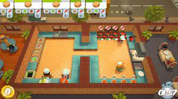

=== Description de la proposition
//*_Note: 2 page max._*

//_Décrire de façon détaillée votre projet : motivations de base/problèmes
//constatés avant élaboration du projet, comment votre projet répond à ces
//besoins. Ajouter une image ou une figure pour montrer à quoi cela
//ressemble si besoin._

Avant l'élaboration de notre projet, nous avons constaté différents problèmes touchant la recherche de métiers durant la scolarité. Tout d’abord, la quantité d’informations facilement accessibles est restreinte en plus d’être inégale en fonction des types de métiers. Les sources sont généralement peu variées et parfois non mises à jour, la majorité des collégiens et lycéens ayant comme principal outil de recherche les fiches métiers de l’ONISEP. De plus, nous savons également que les élèves sont plus ou moins renseignés sur des secteurs professionnels en fonction de leur environnement, cadre de vie, emplois des proches, lieu d’étude etc. 

En outre, malgré le fait de détenir les connaissances générales sur un métier, il est souvent difficile de s’y projeter. Enfin, nous pensons que la recherche de métiers au collège ou lycée est plutôt fastidieuse et manque d’organisation. Souvent, les élèves ne disposent dans l’année que de quelques heures réservées dans leur emploi du temps dédiées à l’orientation : ils doivent alors répondre à un questionnaire de l’onisep censé les aider à choisir une voie. En plus de ne donner qu’un très vague aperçu de ce que peut être le métier, ce questionnaire est souvent vu comme ennuyeux, et peu représentatif des réelles envies de l’élève. Parfois, il est également possible de rencontrer un conseiller d’orientation. Bien que plus interactive, cette méthode n’offre qu’une approche limitée du monde professionnel : un quart d’heure de discussion ne permet pas d’explorer toutes les possibilités. 

Nous voulions donc proposer un projet qui tente de répondre à ces problématiques. L’idée est de rassembler un grand nombre d’informations sur un panel de métiers relativement large. La base d’informations serait directement entretenue par des professionnels qui pourront donner les réalités du terrain; présenter leur quotidien, les enjeux de leur profession, les points forts/positifs et contraintes.

Le jeu sera en 3D, et notre prototype se concentrera uniquement sur le métier d’artisan boulanger. Le joueur pourra effectuer des tâches dans le jeu en cliquant à l’endroit correspondant, se déplacer dans l’environnement de travail ou accéder à des vidéos 360 et des explications des professionnels. Ces vidéos auront été enregistrées directement sur le lieu de travail du professionnel concerné. Cette approche serait alors beaucoup plus immersive pour les étudiants qui pourront avoir une impression plus réaliste du métier qu’ils ont essayé. Le projet sera considéré réussi s'il permet aux élèves de découvrir différents métiers de manière ludique, et s'il leur donne envie de continuer leurs recherches. 

Idéalement, le projet pourra couvrir plusieurs métiers, et pas seulement celui d’artisan boulanger. L’utilisateur pourra choisir d’abord le domaine qui l’intéresse (par exemple sciences, lettres, droit, artisanat…) et ensuite faire une recherche plus précise pour trouver le métier qu’il a envie d’essayer dans le jeu. Chaque simulation sera accompagnée de vidéos 360.

Voici un graphique de jeu dont nous aimerions nous inspirer :

//=== Exemples d'utilisation d'AsciiDoc

//_Ici quelques exemples de syntaxe AsciiDoc pour ajouter //des équations, des images, des listes..._

//_Ces exemples *ne doivent pas* être conservés dans la //version finale du rapport._

//==== Exemples d'équations

//* Inline math: latexmath:[\int_{-\infty}^\infty g(x) dx]
//Pour ajouter une équation ou un symbole mathématique dans le corps du texte.

//* Block math pour avoir une équation centrée au milieu de la page:

//[latexmath]
//++++
//\int_{-\infty}^\infty g(x) dx
//++++

//==== Exemples d'images

//* Ceci est un exemple d'image:

//image::../images/logo_PACT.png[logo pact]

//* L'image peut être redimensionnée et avoir un titre:

//.Le logo du projet
//image::../images/logo_PACT.png[logo pact, 400, 400]

//* Pour le rapport, les images peuvent être aux formats jpeg, png ou même *svg*:

//image::../images/pact.svg[un autre logo pact,300,300]

//* Les images peuvent aussi être mises dans le corps du texte par exemple image:../images/logo_PACT.png[logo pact, 50,50].

//==== Exemples de code

//On peut ajouter des blocs de code formatés en précisant //le langage utilisé:

//[source,python]
//----
//def func(i):
//   x = 3 + i
//   return x
//
//for i in range(10):
//   print "---> ", func(i)
//----

//[source,java]
//----
//class foo {
//   Integer i;
//   String s;
//}
//----

//==== Exemples de listes

//* AAAA
//** aaaaa
//*** axaxax
//** bbbbb
//** ccccc
//* BBBB
//* CCCC
//
//'''''

//.  AAAA
//..  aaaa
//..  bbbb
//.  BBBB
//.  CCCC

//'''''

//.Liste des tâches à faire:
//*  [ ] Pas encore fait
//** [ ] étape X
//** [x] étape Y (a démarré en avance)
//** [ ] étape Z
//*  [x] Complètement finit
//** [x] étape Q
//** [x] étape R
//** [x] étape `finale` E=mc^2^

//'''''

//.Liste descriptive:

//Étape 1::: Faire A, B, C…
//Étape 2::: Faire X, Y, Z…
//Étape 3::: Faire W, et c'est fini…

